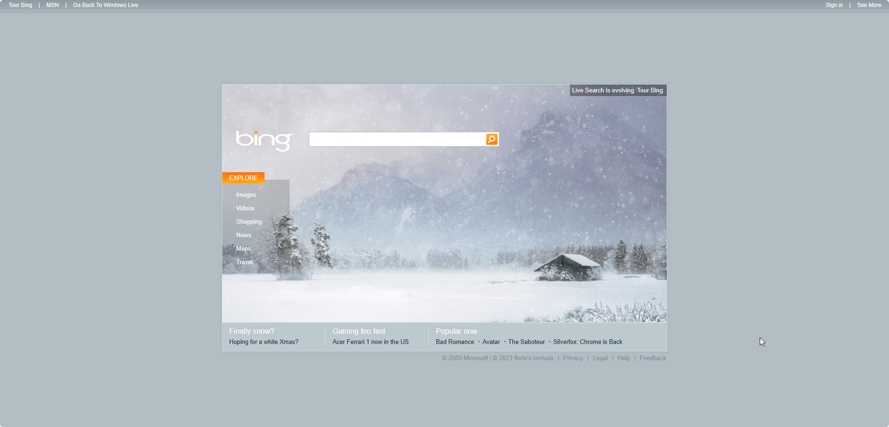
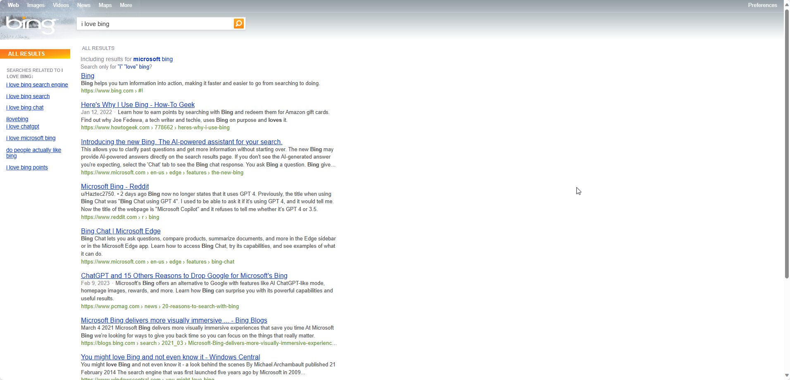
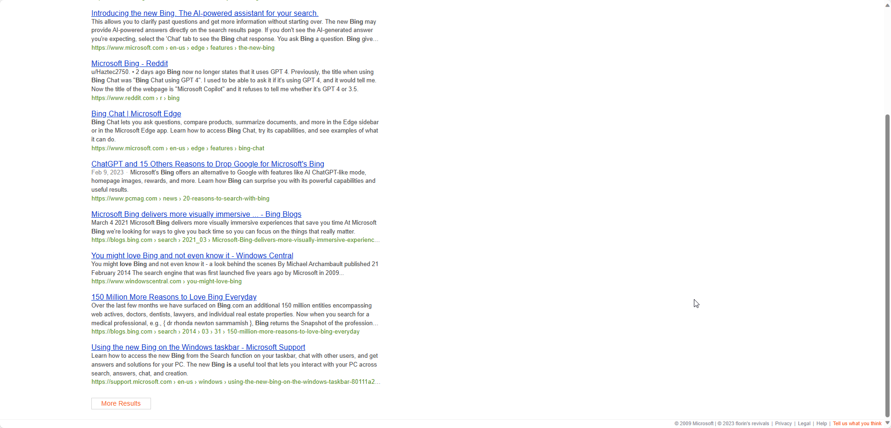
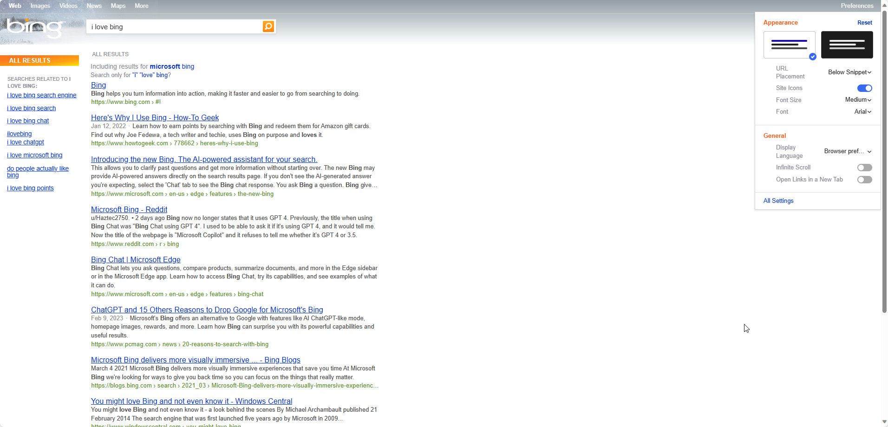
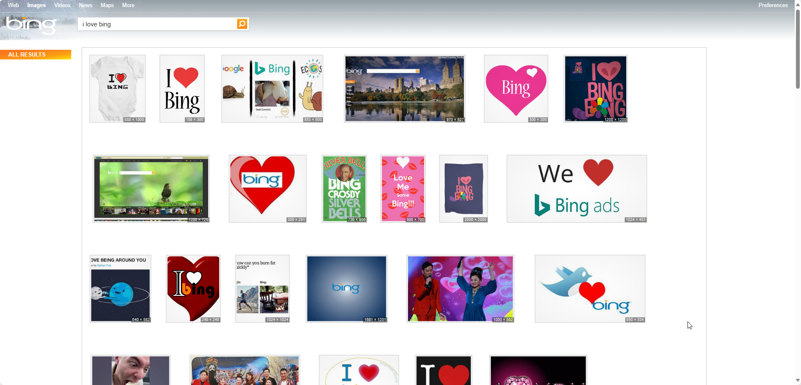
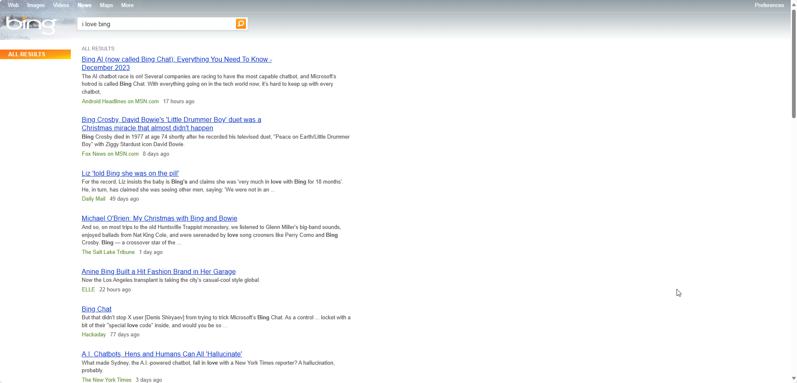
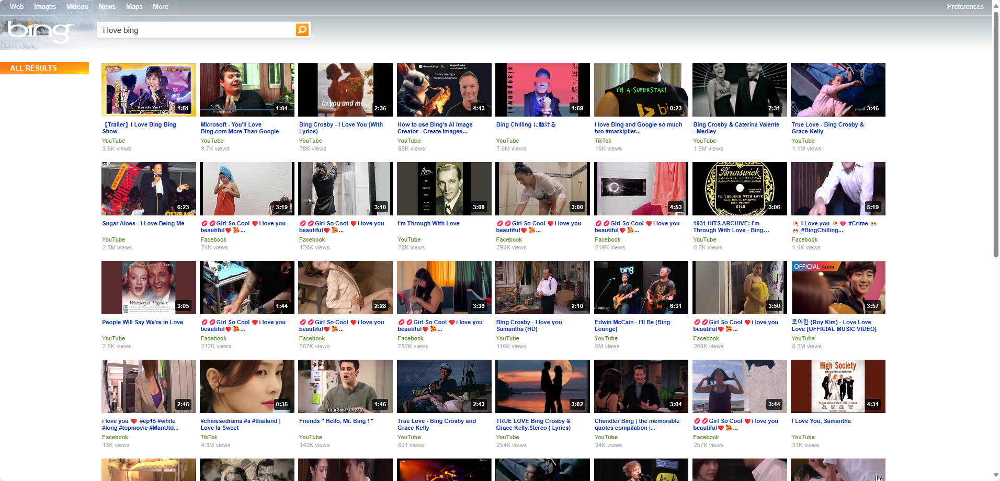
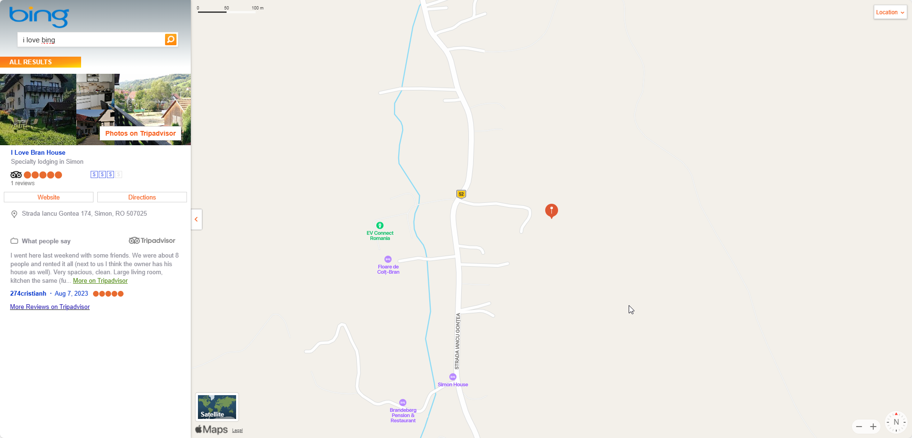

# Welcome back to 2009 Bing!

Back to when Microsoft had good design :)

## Features

* Uses BingBingGo neocities site as homepage, duckduckgo.com redirecting to it.
  * Every month the homepage image and its news change, with time specific articles and Youtube links.
  * Some anniversaries are also included : Windows 8 Day, Windows 10 Day, Bing Anniversary, OG Xbox Day, Xbox 360 Day, Halloween, Windows 7 Day, Windows XP Day, Christmas, New Year's Eve, New Year 1st Day, Valentines Day, Windows Vista Day.
* Search will also reflect the same picture in top left corner.
* Recreated search page, images, news, videos and maps.
* New additions: More will go Tour page, copyright section.
* Favicons changed to 2009 Bing ones.

## How to install?

* Inside DuckDuckGo, in Preferences make sure you set the following:
  * URL Placement: Below Snippet
  * Font Size: Medium
  * Font: Arial
  * In All Settings disable both Page Break Numbers and Page Break Lines.
* Install Tampermonkey for your browser.
* Open both user.jses and make sure they are enabled in Tampermonkey.
* Done.

## Known issues

* Search related is on drugs.
* Images view doesnt properly line up when a image is selected.

## Showcase

* Homepage (BingBingGo neocities):

* Main search page:

* Main search page (bottom):

* Main search page (Preference Pane):

* Images section:

* News section:

* Videos section:

* Maps section:

